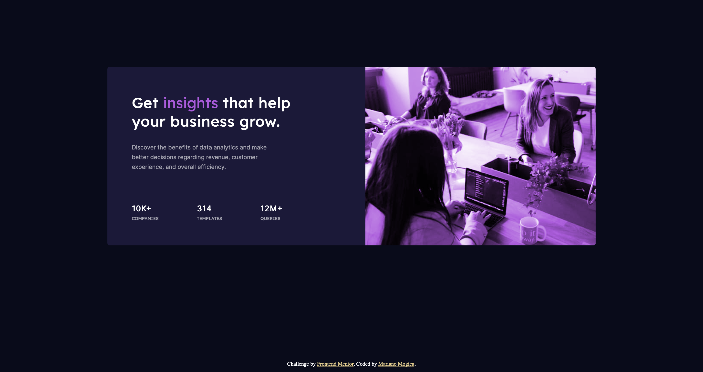

# Frontend Mentor - Stats preview card component solution

This is a solution to the [Stats preview card component challenge on Frontend Mentor](https://www.frontendmentor.io/challenges/stats-preview-card-component-8JqbgoU62). Frontend Mentor challenges help you improve your coding skills by building realistic projects. 

## Table of contents

- [Overview](#overview)
  - [Screenshot](#screenshot)
  - [Links](#links)
- [My process](#my-process)
  - [Built with](#built-with)
  - [What I learned](#what-i-learned)
  - [Continued development](#continued-development)
  - [Useful resources](#useful-resources)
- [Author](#author)

## Overview

On this challeng I had to build a card component and get it look as close to design as posible


Users should be able to:

- View the optimal layout depending on their device's screen size

### Screenshot




### Links

- Solution URL: [](https://github.com/Mariano7M/StatsCard)
- Live Site URL: [](https://mariano7m.github.io/StatsCard/)

## My process

In order to complete this challenge I started with the structure of the content in the HTML file. Once I had the structure I started with css file.
One the firts things I started to style was the fonts and primary colors. Then I continued with the containers for the card and their contents. I had difficulty with the image so I had to look for ways to overlay a colored backgroung with the image. I decided to use Flexbox because I thought it might be useful for the responsive part, but that wasn't true.
With a little search on flexbox I was able to finish the Challenge.

### Built with

- Semantic HTML5 markup
- CSS custom properties
- Flexbox

### What I learned

The is one of things I learned was the use of flexbox, specially for the responsive part.

```css
.container {
  display: flex;
  flex-direction: column;
  justify-content: center;
  align-items: center;
  margin-left: auto;
  margin-right: auto;
  height: 100vh;
  width: 100vw;
}
```

### Continued development

I know there are many other forms to make a web page responsive but I decided to use flexbox for this challenge, and I think I have to learn more about flexbox to improve what I done. 
Probably with other challenges I'll decide another approach.


### Useful resources

- [W3Schools CSS Flex Container](https://www.w3schools.com/css/css3_flexbox_container.asp) - This helped me because I forgot how to use Flexbox.
- [CSS-TRICKS background-blend-mode](https://css-tricks.com/almanac/properties/b/background-blend-mode/) - This is an amazing article where I found the property backgroung-blend-mode. I tried many ways on to combine the image with the color and with this article i found a way to do it. 

## Author

Mariano Mogica

- Frontend Mentor - [@Mariano7M](https://www.frontendmentor.io/profile/Mariano7M)
- Twitter - [@10MARINHO](https://twitter.com/10MARINHO)
